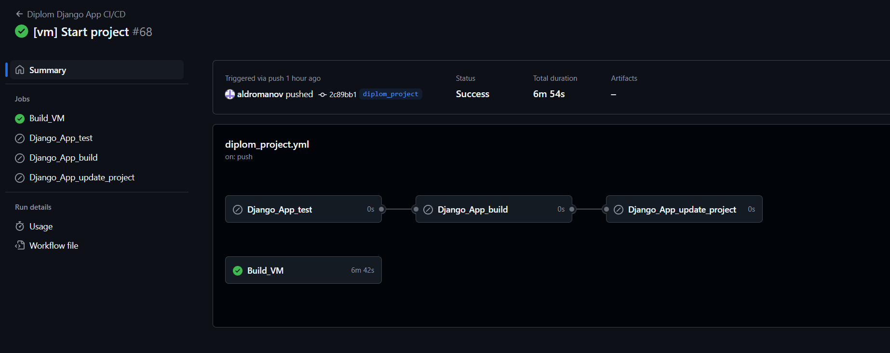

Результат выполнения дипломного проекта:<br />
[Папка с результатами](images)

Для работы с Yandex Cloud необходимо задать переменные окружения:
```bash
export ACCESS_KEY="YCA**"
export SECRET_KEY="YCO**"
```

# 1. Клонируем репозиторий

Копируем папку ***diplom_project*** из текущего репозитория.

# 2. Запускаем terraform

Создаем файл ***terraform.tfvars*** с переменными:
```bash
yandex_cloud_id  = ""
yandex_folder_id = ""
```

Переходим в директорию terraform-yandex клонированного репозитория:
```bash
terraform init -backend-config="access_key=$ACCESS_KEY" -backend-config="secret_key=$SECRET_KEY" 
```
Запуск сборки:
```bash
terraform apply
```
# 3. Запускаем GitHub runner

После окончания запуска ВМ подключаемся по ssh и выполняем:
```bash
cd actions-runner
./config.sh --url https://github.com/${GH_OWNER}/${GH_REPOSITORY} --token ${REG_TOKEN}
./run.sh
```
# 4. Проверяем работу сервиса

Запускаем сборку контейнера:
```bash
git commit -m '[vm] ...'
```

Запуск сборки с внесенными изменениями:
```bash
git commit -m '[app] ...'
```


# 5. Выполнить команду для уничтожения сборки:
```bash
terraform destroy
```
