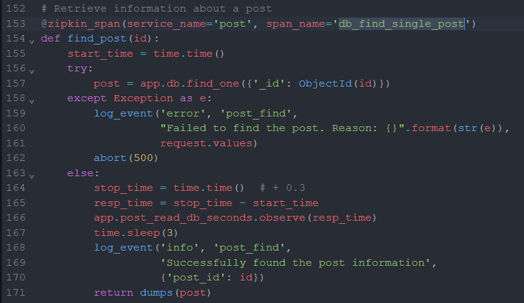
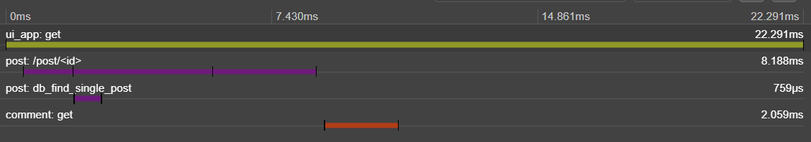

1. При отправке *post* запроса **post/<id>** была обнаружена длительная задержка вывода информации о посте.

Замечаем, что проблема на стороне сервиса **POST**, а точнее в модуле **db_find_single_post**.
2. При анализе приложения **POST** находим соответствующие **span_name='*db_find_single_post*'**.

И обнаруживаем проблему задержки отображения, в строке 167 у нас указан `time.sleep(3)`.
4. Если закомментировать 167 строку и перезапустить приложение **POST**, то *post* запросы будут отрабатывать в среднем за ~23ms
